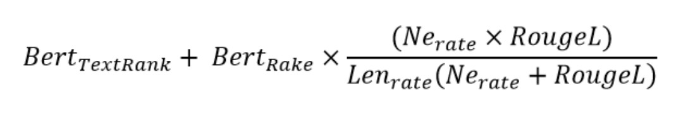

# Multi-Document Summarization for Russian
### Authors: Alexandra Konovalova, Alina Tillabaeva, Egor Plotnikov, Elizaveta Klykova

## Data
Summaries of 944 chapters in 67 Russian classical books. [Dataset at huggingface.co](https://huggingface.co/datasets/c00k1ez/summarization)

## Experiments
Comparison of TextRank, Hierarchical and pre-trained multilingual mBART and mT5 algorithms.

## Gold Standard
To assess the summarization quality, another dataset was compiled. Various summaries of 7 chapters in different books were collected and evaluated by experts on a scale from 1 to 5 (1 = very bad, 5 = excellent). The chapters were all different in word count to reduce possible length bias of the metrics. 102 summaries (\~15 per chapter) were collected.

The dataset file **gold_standard.xlsx** contains the following fields: book_id, book_title, chapter_id, chapter_title, chapter_summary, summary_source, length_score (length of summary / length of chapter), human_score, is_best, comments, length_summary (words).

## Summary Evaluation: Idea
* Rely on keywords and named entities, since they (intuitively) represent important features of the plot
* Take into account existing SOTA metrics, balancing those that favor extractive vs. abstractive summarization
* Correct for relative summary length

## Summary Evaluation: Algorithm
We propose a summarization evaluation metric based on several existing algorithms. Our metric is composed of the following steps:
1. Keyword extraction
2. Calculation of BERTScore between keywords from the chapter and those from the summary
3. Named Entity extraction (the intersection of NEs in the chapter and the summary is considered)
4. Calculation of ROUGE-L
5. Adjustment for summary length

* Bert_TextRank – BERTScore on graph keywords
* Bert_Rake – BERTScore on accented keywords
* Ne_rate – the percentage of NE found in the summary relative to the chapter
* Rouge-L – ROUGE-L for the longest sequence
* Len_rate – length of summary / length of chapter

To use the metric, see **likeScore.py** in this repository. Additional code & experiments can be found [here](https://drive.google.com/file/d/17KUduCVerystWpyty8sA6jI74bNG1wkn/view?usp=sharing). For more info on the task and the metric, refer to **final_presentation.pdf**. 

## Summary Evaluation: Results
Spearman correlation coefficient between expert judgements and:
* Summary length: 0.32
* Length of summary / length of chapter: 0.54
* Number of NEs in summary: 0.28
* Number of NEs in summary / number of NEs in chapter: 0.57
* METEOR: 0.56
* ROUGE-L: 0.59
* BERTScore: 0.51
* **Our metric: 0.64**
